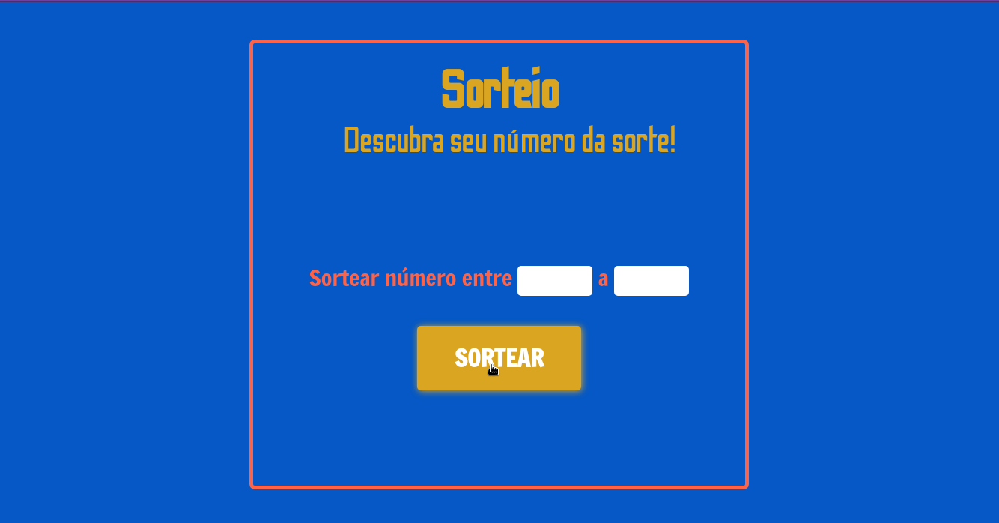

# sorteio
Project Sorteio

Este projeto, começo introduzir JavaScript nas aplicações.

Um sistema simples de sorteio. Apesar de simples é, flexivel.
Isso por que permite que o usuário escolha entre um número a outro, como de 0 a 10, o número que será sorteado.
Este dinamismo permite que o usuario interaja de forma eficiente e alternativamente com a aplicação.

LINK PARA ACESSAR O PROJETO: https://bruno3du.github.io/sorteio/

### TO DESKTOP

  

